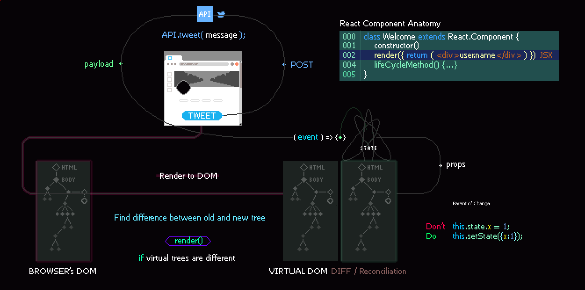

## React: основы


[Дмитрий Вайнер](https://github.com/dmitryweiner)

---

### Идея

---

### Обновление DOM-дерева

---

### Установка
* Использование [CDN](https://ru.wikipedia.org/wiki/Content_Delivery_Network).
* Создание проекта с помощью [CRA](https://github.com/facebook/create-react-app).
* Редактирование конфига Webpack вручную.
---

### Использование CDN
* Для маленьких проектов удобнее использовать React без транспиляции и сборки.
* Транспиляция будет происходить прямо в браузере благодаря библиотеке [Babel Standalone](https://babeljs.io/docs/en/babel-standalone).
* Для запуска нужно подключить 2 библиотеки:
  * React.
  * React-DOM.
---

### Использование CDN
```html
<!doctype html>
<html lang="ru">
<head>
    <meta charset="utf-8">
    <script src="https://unpkg.com/react@17/umd/react.production.min.js"></script>
    <script src="https://unpkg.com/react-dom@17/umd/react-dom.production.min.js"></script>
    <script src="https://unpkg.com/@babel/standalone/babel.min.js"></script>
    <script type="text/babel">
        function App() {
            return <>Hello world</>;
        }
        ReactDOM.render(<App/>, document.getElementById('root'));
    </script>
</head>
<body>
    <div id="root"></div>
</body>
</html>
```
---

### JSX

Компонент должен возвращать JSX-лист, который встраивается в виртуальное DOM-дерево.
Компонент-класс делает это в методе render(), компонент-функция просто возвращает JSX.

```jsx
function Component() {
    return <span>А я компонент!</span>;
}

class Component extends React.Component {
    render() {
        return <span>И я компонент!</span>;
    }
}
```
---

### Узлы JSX

JSX состоит из узлов (листьев). Нельзя вернуть несколько узлов просто так.
Они должны быть обёрнуты в <></> (Это короткая запись [React.Fragment](https://reactjs.org/docs/fragments.html)).

Так неправильно:
```jsx
return <p>Покормить кота</p>
     <p>Искупать рыб</p>;
```

Так правильно:
```jsx
return <>
    <p>Покормить кота</p>
    <p>Искупать рыб</p>
</>;
```
---

### Формат вызова компонентов в JSX

```jsx
<Component
    text="some test" // так передаем строку
    number={123} // число
    value={value} // значение переменной
    someFunction={functionName} // ссылка на функцию
    anotherFunction={() => /..../} // анонимная функция 
/>
```

Точно так же можно поступать с HTML-тегами. У них есть свой набор параметров, их можно указывать:
```jsx
<input type="text" value={5}/>
```
---

### Вывод списков
Элементы динамического списка должны обладать атрибутом key. Если у элементов есть id, нужно использовать его.
Если нет возможности сгенерировать id, можно использовать индекс массива, но при обновлении массива это
чревато проблемами с обновлением.
```jsx
function List() {
    const items = [1, 2, 3];
    return <ul>
        {items.map((item, index) => <li key={index}>{/* временное решение */}
            {item}
        </li>)}
    </ul>;
}
```
---

### Вывод списков
Если у элементов есть id, нужно использовать его.

```jsx
function List({ items }) {
    return <ul>
        {items.map(item => <li key={item.id}>{/* хорошее решение */}
            {item.title}
        </li>)}
    </ul>;
}
```
---

### Полезные ссылки
https://learn-reactjs.ru/home
https://jstutorial.medium.com/react-animated-tutorial-7a46fa3c2b96