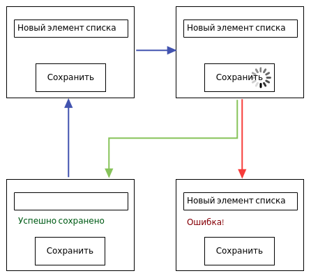

## Redux: обращение к API


[Дмитрий Вайнер](https://github.com/dmitryweiner)

[Видео](https://drive.google.com/file/d/1ddXI9pbTwAUW-mympJw-pvqUv5QtGfr8/view?usp=sharing)

---


---

### С точки зрения компонента


---

### Важно!
* Пользователь **очень** не любит, когда он "писал-писал, а всё исчезло".
* При переходе в состояние ошибки **ЗАПРЕЩЕНО** очищать поля ввода.
* Если же запрос отработал успешно, поля ввода можно и очистить (если так заложено в логике компонента).

---

### Redux-thunk
* Чтобы работали асинхронные запросы, необходимо поставить redux-thunk:
```shell
 npm i redux-thunk
```
* Добавить его в middleware при создании стора:
```ts
// store.ts
import thunkMiddleware from 'redux-thunk';
import { createStore, applyMiddleware } from 'redux';
const store = createStore(reducer, applyMiddleware(thunkMiddleware));
export type AppDispatch =  typeof store.dispatch; // пригодится
export default store; // подключим в index.ts
```

---

### Store
* ```requestStatus```: поле, где лежит текущее состояние запроса 
  * ```IDLE```, ```LOADING```, ```SUCCESS```, ```ERROR```.
* Допустимо выделять состояние "загрузка" в отдельное поле ```isLoading```.
* Допустимо не выделять состояние ```SUCCESS```, если это никак не отображается в UI.
* ```error```: поле, где лежит ошибка.
* ```data```: поле, где лежит то, за чем ходили в API (название для примера).

---

### Store
```ts
enum REQUEST_STATUS {
    IDLE,
    LOADING,
    SUCCESS,
    ERROR
}

type Store = {
    data: []; // какие-то полезные данные, за которыми ходим в API
    requestStatus: REQUEST_STATUS;
    error: string;
}
```

---

### Action
* Вывешиваем флаг LOADING.
* Отправляем запрос на сервер.
* Когда что-то приходит:
  * Ставим флаг SUCCESS (опционально, если отображаем в UI).
  * Сохраняем в стор то, что пришло.
* Если неудача:
  * Вывешиваем флаг ERROR.
  * Сохраняем ошибку в стор.

---

### Actions
* Установка текущего статуса запроса:
```ts
export const setRequestStatus = (requestStatus: REQUEST_STATUS) => ({
    type: ACTION_TYPES.SET_REQUEST_STATUS,
    payload: requestStatus
});
```
* Сохранение результата:
```ts
const saveResult = (result: DATA) => ({ // тип DATA на усмотрение создателя
    type: ACTION_TYPES.SET_RESULT,
    payload: result
});
```
* Сохранение ошибки:
```ts
const saveError = (error: string) => ({
    type: ACTION_TYPES.SET_ERROR,
    payload: error
});
```

---

### Action отправки запроса
* Тип ```dispatch``` берём [из ```store```](https://dmitryweiner.github.io/lectures/Redux%20API.html#/4).
```ts
const saveNewItem = (value: string) => async (dispatch: AppDispatch) => {
    const newObject = {
        title: value
    };
    try {
        dispatch(setApiState(API_STATE.LOADING));
        const response = await fetch(URL, {method: 'POST', body: newObject});
        if (!response.ok) {
            throw Error(response.statusText);
        }
        const result = await response.json();
        dispatch(saveResult(result));
        dispatch(setApiState(API_STATE.SUCCESS));
    } catch (err) {
        dispatch(saveError(err.message))
        dispatch(setApiState(API_STATE.ERROR));
    }
};
```

----
```ts
function saveNewItem(value: string) {
    return function (dispatch) {
        const newObject = {
            title: value
        };
        dispatch(setApiState(API_STATE.LOADING));
        fetch(URL, {method: 'POST', body: newObject})
            .then(function (response) {
                if (!response.ok) {
                    throw Error(response.statusText);
                }
                return response.json();
            })
            .then(function (result) {
                dispatch(saveResult(result));
                dispatch(setApiState(API_STATE.SUCCESS));
            })
            .catch (function(err) {
                dispatch(saveError(err.message))
                dispatch(setApiState(API_STATE.ERROR));
            });
    }
}

```
---

### На всякий случай
* Если в асинхронном экшене понадобится текущее состояние стора, можно его получить вторым аргументом:
```js
const asyncAction = () => async (dispatch, getState) => {
    const state = getState();
    // тут некий код, учитывающий state
};
```

---

### Reducer
```ts
case ACTION_TYPES.SET_REQUEST_STATUS:
    return {
        ...state,
        requestStatus: action.payload
    };
case ACTION_TYPES.SET_ERROR:
    return {
        ...state,
        error: action.payload
    };
case ACTION_TYPES.SET_RESULT:
    return {
        ...state,
        data: action.payload
    };
```

---
### Component
* Подготавливаем данные для отображения:
```ts
const dispatch = useDispatch();
const { data, error, requestStatus } = useSelector((state: Store) => state);
const [isSuccess, setIsSuccess] = useState(false);
useEffect(() => {
    if (requestStatus === REQUEST_STATUS.SUCCESS) {
        setIsSuccess(true);
        dispatch(setRequestStatus(REQUEST_STATUS.IDLE)); // сбросить флаг SUCCESS
        setTimeout(() => setIsSuccess(false), 3000); // скрыть сообщение через 3 с
    }
}, [requestStatus]);
```
* Рендер:
```tsx
{requestStatus === REQUEST_STATUS.LOADING && <>Loading...</>}
{requestStatus === REQUEST_STATUS.ERROR && <>Error: {error}</>}
{isSuccess && <>Успешно!</>}
{data && <>{data}</>}
<button onClick={() => dispatch(saveNewItem('новый объект!'))}>send</button>
```

---

### Недостатки подхода
* Код обработки ошибок дублируется в каждом экшене.
* Выделим его в отдельный файл ```api.ts```:
```ts
const URL = 'http://localhost:3001';
const defaultHeaders = {
    'Content-Type': 'application/json'
};
async function handleErrors(response: any) {
    const data = await response.json();
    if (response.status !== 200) {
        throw new Error(data.error);
    }
    return data;
}
const api = {
    todos: {
        add: ({title}: {title: string}) => fetch(`${URL}/todos`, {
            method: 'POST',
            headers: defaultHeaders,
            body: JSON.stringify({
                title: title
            })
        }).then(handleErrors),
        list: () => fetch(`${URL}/todos`, {
            method: 'GET',
            headers: defaultHeaders
        }).then(handleErrors)
    }
};
export default api;
```

----

### Экшен становится лаконичнее
```ts
export const addElement = (title: string) => async (dispatch: AppDispatch) => {
    try {
        dispatch(setRequestStatus(REQUEST_STATUS.LOADING));
        const data = await api.todos.add({title});
        // Тут должна быть проверка или приведение типа data.
        // @see https://dmitryweiner.github.io/lectures/TypeScript.html#/38
        dispatch({type: ACTION_TYPES.ADD, payload: data});
        dispatch(setRequestStatus(REQUEST_STATUS.SUCCESS));
    } catch (error) {
        dispatch(setError(error.message));
        dispatch(setRequestStatus(REQUEST_STATUS.ERROR));
    }
}
```

---

### Плюсы и минусы подхода в целом:
* Плюсы:
  * Просто.
* Минусы:
  * При разрастании будет много однотипного кода для каждого endpoint API.
  * Засорение стора однотипными полями для каждого endpoint'а.

---

### Что делать дальше?
* Библиотека [redux-api-call](https://github.com/tungv/redux-api-call):
```js
const todoListAPI = makeFetchAction(
    'TODO_LIST',
    (params) => ({ endpoint: `/api/v1/todos?page=${params.page}&limit=${params.limit}` })
);
```
* Библиотека [redux-api-middleware](https://github.com/agraboso/redux-api-middleware):
```js
import { createAction } from 'redux-api-middleware';
createAction({
    endpoint: 'http://www.example.com/api/users',
    method: 'GET',
    types: ['REQUEST', 'SUCCESS', 'FAILURE']
})
```
* Библиотека [redux-query](https://github.com/amplitude/redux-query):
  * [Пример](https://amplitude.github.io/redux-query/docs/examples/simple).

---

### Как это тестировать?

[Лекция про тестирование redux-thunk](https://dmitryweiner.github.io/lectures/Test%20Redux%20Thunk.html#/)


---

### Полезные ссылки
* [Как работать с fetch](https://learn.javascript.ru/fetch).
* [Официальная документация по асинхронным запросам](https://redux.js.org/tutorials/fundamentals/part-6-async-logic).
* [Ещё документация](https://redux.js.org/tutorials/essentials/part-5-async-logic).
* [Сервер, отвечающий нужным HTTP-кодом](http://httpstat.us/404).
* [Тестовое API](https://jsonplaceholder.typicode.com/posts).