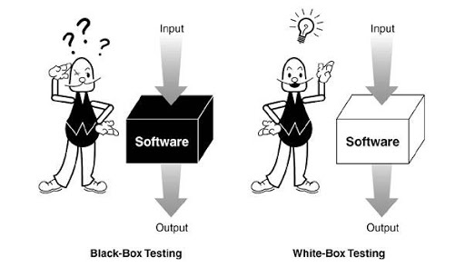
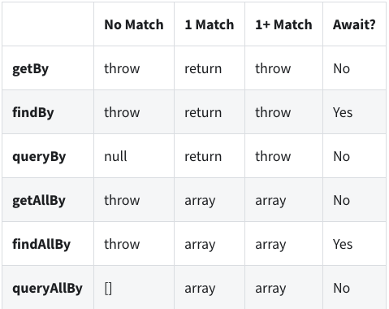

## React: тестирование компонентов


[Дмитрий Вайнер](mailto:dmitry.weiner@gmail.com)

[видео 1](https://drive.google.com/file/d/1oG1geSnRc68Lj-lm-g9u7f506GgHq6gm/view?usp=sharing),
[видео 2](https://drive.google.com/file/d/1R-ke3qpaJOxy0HFrEkkjxE-a39srlX6Z/view?usp=sharing)

---

### Типовой тест

Этот тест создаётся автоматически при ```npx create-react-app```

```javascript
import { render, screen } from '@testing-library/react';
import App from './App';

test('renders learn react link', () => {
  render(<App />);
  const linkElement = screen.getByText(/learn react/i);
  expect(linkElement).toBeInTheDocument();
});
```

---

### Идеология тестирования

* Black box: без знаний о компоненте.

* White box: со знанием устройства компонента.



---

### Методика тестирования

* Отрендерить компонент.
* Вызывать нужные события (опционально).
* Активировать таймеры (опционально).
* Найти нужный элемент.
* Взять его содержимое.
* Проверить на соответствие ожиданиям.
* [Шаблон Arrange Act Assert](https://medium.com/@pjbgf/title-testing-code-ocd-and-the-aaa-pattern-df453975ab80)

---

### Setup / teardown

* Используется для создания и удаления тестовых данных, которые могут понадобиться в ходе тестов.
  * **beforeEach**: выполнить код перед каждым тестом.
  * **afterEach**: выполнить код после каждого теста.
  * **beforeAll**: выполнить код перед запуском тестов (коннект к базе, например).
  * **afterAll**: выполнить код после запуска (удаление тестовых данных).

---

### Рендер компонента

* Метод **render**:

```js
import { render } from '@testing-library/react';
import Component from './Component';

render(<Component prop="value" />);
```

* Результат лежит в **screen**.

---

### Поиск нужных элементов

```javascript
import { screen } from '@testing-library/react';
screen.getByText(/Item #[0-9]: /);
```

* **ByTestId**: по test-id.
* **ByText**: по тексту.
* **ByDisplayValue**: по отображаемому значению.
* **ByRole**: по роли.
* **ByLabelText**: по лейблу.
* **ByPlaceholderText**: по плейсхолдеру.  
* **ByTitle**: по тайтлу.
* **ByAltText**: по параметру alt="".
[Документация](https://testing-library.com/docs/react-testing-library/cheatsheet/#queries)

---

### Варианты поиска

```javascript
await screen.findByText(/Item #[0-9]: /);
```



---

### Варианты поиска

* Синхронные: getBy<>, getAllBy<>, queryBy<>, queryAllBy<>.
* Асинхронные: findBy<>, findAllBy<>.
  * Ждут 1 секунду, пока элемент появится, потом exception.
  * Можно изменить время ```findByText('text', { timeout: 5000 })```
  * Обработчик теста должен быть async.

---

### Поиск

* Ищем вот этот DIV

```jsx
<div>Hello World</div>
```

* Методы поиска

```javascript
// По строке:
getByText('Hello World'); // полное совпадение
getByText('llo Worl', { exact: false }); // частичное совпадение
getByText('hello world', { exact: false }); // игнорируем регистр

// Matching a regex:
getByText(/World/); // поиск подстроки
getByText(/world/i); // поиск подстроки без регистра
getByText(/^hello world$/i); // полное совпадение без регистра
getByText(/Hello W?oRlD/i); // advanced regex

// Кастомная функция поиска:
getByText((content, element) => content.startsWith('Hello'));
```

---

### Ожидание реакции компонента

**waitFor()**: Вызывает функцию до тех пор, пока она не перестанет выбрасывать исключение,
или пока не закончится 1 секунда.

```js
await waitFor(() => screen.getByRole('alert'));
// короткая запись такого:
await screen.findByRole('alert');
```

---

### Эмуляция событий

* fireEvent.<имя события>(найденная нода)
```js
fireEvent.click(screen.getByText('Нажми меня'));
```
* Можно передать данные в событие:
```js
fireEvent.input(element, { 
    target: { value: 'Some text' } 
});
```
* Возможные события:
  * click
  * submit
  * input
* [Список событий](https://github.com/testing-library/dom-testing-library/blob/master/src/event-map.js).

---

### Изменения стейта и асинхронность

* Изменение стейта и последующий рендер происходят не мгновенно.
* Тест должен подождать, пока всё отрендерится после действий пользователя.
* Для этого используется метод **act**(() => {}) ([документация](https://reactjs.org/docs/testing-recipes.html#act)).
* Оборачиваем в act то, что меняет стейт (даже рендер).
* Асинхронные методы поиска элементов findBy<что-то> уже [содержат в себе act](https://testing-library.com/docs/dom-testing-library/api-async/).

---

### Работа с таймером

* Настоящий таймер.

```js
await new Promise(resolve => setTimeout(resolve, 1000));
```

* Фейковый таймер.

```js
jest.useFakeTimers(); // включить фейковые таймеры (beforeEach)
jest.runAllTimers(); // выполнить вообще все таймеры
jest.runOnlyPendingTimers(); // выполнить все взведённые таймеры
jest.advanceTimersByTime(1000); // перемотать время на 1 с
jest.useRealTimers(); // отключить фейковые таймеры (afterEach)
```

[Документация](https://jestjs.io/docs/en/timer-mocks)

---

### Ожидания

* expect(что-то).to<ожидание>()
* Можно вставить expect().not.to<ожидание>()
* **toBeInTheDocument**: проверка на существование.
* **toHaveLength**: длина массива столько-то.
* **toHaveTextContent**: содержимое такое-то.
* **toHaveValue**: значение инпута.
* **toHaveAttribute**: существование атрибута с нужным значением.
* **toHaveClass**: навешен нужный класс.

[Полный список](https://github.com/testing-library/jest-dom#custom-matchers), [Jest matchers](https://jestjs.io/docs/en/using-matchers)

---

### Пример с представлением

* Написать компонент, который просто отображает проп text.
* Пишем вначале тест:

```js
import { render, screen } from '@testing-library/react';

test('renders what it got', () => {
  const text = 'Test text';
  render(<Component text={text} />);
  const element = screen.getByTestId('component');
  expect(element).toBeInTheDocument();
  expect(element).toHaveTextContent(text);
});
```

---

### Компонент-представление

* Потом пишем компонент, чтобы тест проходил

```jsx
function Component({ text }) {
    return <span data-testid="component">{text}</span>;
}
```

---

### Компонент-список

* Написать компонент, который отображает массив строк.
* Если передали пустой массив, отображает текст "Список пуст".
* Напишем вначале тест на положительный кейс (список полон):

```js
import { render, screen } from '@testing-library/react';

test('renders full list', () => {
  const list = ['one', 'two', 'three'];
  render(<List list={list} />);
  const elements = screen.getAllByTestId('list-item');
  expect(elements).toHaveLength(list.length);
  expect(elements[0]).toHaveTextContent(list[0]);
});
```

---

### Негативный кейс

* Напишем тест на случай с пустым массивом:

```js
import { render, screen } from '@testing-library/react';

test('renders empty list', () => {
  const list = [];
  render(<List list={list} />);
  const element = screen.getByTestId('list');
  expect(element).toHaveTextContent('Список пуст');
});
```

---

### Напишем компонент, проходящий тесты

```jsx
function List({ list }) {
  function renderList() {
    if (!list.length) {
      return 'Список пуст';
    }
    return list.map((item, index) => (
      <li key={index} data-testid="list-item">
        {item}
      </li>
    ));
  }
    
  return <ul data-testid="list">
    {renderList()}
  </ul>;
}
```

---

### Кнопка

* Должна отображать надпись, переданную в title.
* При нажатии должна вызывать handleClick.

```js
import { render, screen, fireEvent } from '@testing-library/react';

test('renders empty list', () => {
  const title = 'title';
  const handleClick = jest.fn();
  render(<Button title={title} handleClick={handleClick} />);
  const element = screen.getByText(title);
  expect(element).toBeInTheDocument();
  expect(handleClick).not.toBeCalled();
  fireEvent.click(element);
  expect(handleClick).toBeCalled();
});
```

---

### Кнопка

* Реализация кнопки довольно лаконичная:

```jsx
function Button({ title, handleClick }){
  return <button onClick={handleClick}>{title}</button>;
}
```

---

### Форма

* Должна отображать поле.
* В которое можно что-то ввести.
* При сабмите формы вызывается handleSubmit.
* Этому обработчику в виде параметра передаётся объект вида ```{field: "что-то ввели"}```.
* То, что пришло обработчику, должно совпадать с тем, что ввели.

---

### Форма

* Тест:

```js
import { render, screen, fireEvent } from '@testing-library/react';

test('can enter text and submit', () => {
  const handleSubmit = jest.fn();
  const field = 'field contents';
  render(<Form handleSubmit={handleSubmit} />);
  const input = screen.getByTestId('input');
  const form = screen.getByTestId('form');
  fireEvent.input(input, { target: {value: field }}); // ввод в поле
  expect(handleSubmit).not.toBeCalled();
  fireEvent.submit(form); // отправка формы
  expect(handleSubmit).toBeCalledWith(expect.objectContaining(
    { field }
  ));
});
```

---

### Форма

* Компонент:

```jsx
function Form({ handleSubmit }) {
  const [field, setField] = useState('');
  function handleSubmitInner(e) {
    e.preventDefault();
    handleSubmit({ field });
  }
  return <form data-testid="form" onSubmit={handleSubmitInner}>
    <input
      data-testid="input"
      value={field}
      onChange={e => setField(e.target.value)}/>
    <button type="submit">Submit</button>
  </form>;
}
```


---

### Таймер

* При появлении на экране таймер начинает отсчитывать секунды.
* Секунды начинают идти с 0 до бесконечности.

```js
import { render, screen } from '@testing-library/react';

test('timer works', async () => {
    jest.useFakeTimers();
    render(<Timer />);
    expect(await screen.findByTestId('timer'))
        .toHaveTextContent('0');
    // тут меняется стейт в useEffect, поэтому act():
    act(() => jest.advanceTimersByTime(1000));
    expect(await screen.findByTestId('timer'))
        .toHaveTextContent('1');
    jest.useRealTimers();
});
```

---

### Таймер

* Компонент:

```jsx
function Timer() {
  const [count, setCount] = useState(0);
  
  useEffect(() => {
    const intervalId = setInterval(() => {
        setCount(count => count + 1);
    }, 1000);
    return () => clearInterval(intervalId);
  }, []);
  
  return <span data-testid="timer">{count}</span>;
}
```

---

### Полезные ссылки

* Testing-library:
  * [Шпаргалка](https://testing-library.com/docs/react-testing-library/cheatsheet/)
  * [Документация](https://testing-library.com/docs/)
  * [Список matchers](https://github.com/testing-library/jest-dom#custom-matchers)
* [Список matchers jest](https://jestjs.io/docs/en/using-matchers)
* [Рецепты тестирования реакта](https://reactjs.org/docs/testing-recipes.html)
