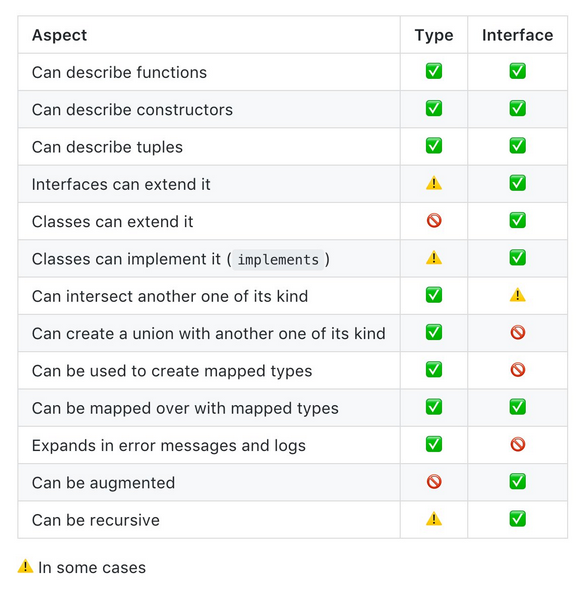
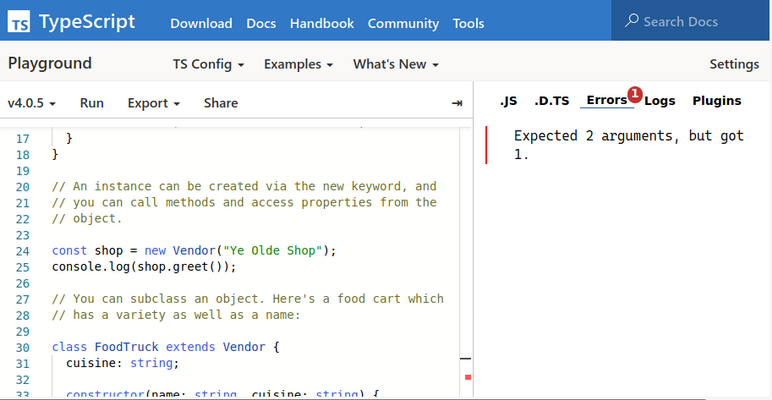

## TypeScript


[Дмитрий Вайнер](mailto:dmitry.weiner@gmail.com)

[видео](https://drive.google.com/file/d/1Qq_gC5TsY29wuteXrRVewQcCPfU4RHld/view?usp=sharing)

---

### Идея

* Писать большие проекты на языках без типизации &mdash; к беде.
* Но у нас много библиотек на JS.
* JS такой гибкий, удобный и лёгкий язык.
* Вот бы в JS была система типов!
* Пусть разработчик сам её и пишет.


---

### Варианты типизации

* [Система типов](https://ru.wikipedia.org/wiki/%D0%A1%D0%B8%D1%81%D1%82%D0%B5%D0%BC%D0%B0_%D1%82%D0%B8%D0%BF%D0%BE%D0%B2)
* Статическая или динамическая.
  * На этапе компиляции или во время выполнения.
* Строгая (сильная) или не строгая.
  * Строгая: есть приведение типов.
  * Слабая: утиная типизация.

---

### Утиная типизация

> Если это выглядит как утка, плавает как утка и крякает как утка, то это, вероятно, и есть утка.

* Если объект реализует все методы интерфейса, то он реализует этот интерфейс.
* Даже если тип у него называется иначе.
* Независимо от связей в иерархии типов.
* [Утиная типизация](https://ru.wikipedia.org/wiki/%D0%A3%D1%82%D0%B8%D0%BD%D0%B0%D1%8F_%D1%82%D0%B8%D0%BF%D0%B8%D0%B7%D0%B0%D1%86%D0%B8%D1%8F)

---

### TypeScript


* Создан в 2012 г. [Андерсом Хейлсбергом](https://ru.wikipedia.org/wiki/%D0%A5%D0%B5%D0%B9%D0%BB%D1%81%D0%B1%D0%B5%D1%80%D0%B3,_%D0%90%D0%BD%D0%B4%D0%B5%D1%80%D1%81).
* Статический контроль типов.
* Слабая (утиная) типизация.
* Выводит типы.
* [Дженерики](https://ru.wikipedia.org/wiki/%D0%9E%D0%B1%D0%BE%D0%B1%D1%89%D1%91%D0%BD%D0%BD%D0%BE%D0%B5_%D0%BF%D1%80%D0%BE%D0%B3%D1%80%D0%B0%D0%BC%D0%BC%D0%B8%D1%80%D0%BE%D0%B2%D0%B0%D0%BD%D0%B8%D0%B5).

---

### Плюсы:
* Строгая типизация.
* Типизация опциональна.
* Контроль типов на этапе компиляции.
* Код по-прежнему выполняется в JS со всеми его плюсами.
* Лёгкость рефакторинга.
* Autocomplete.

---

### Минусы:
* Контролируется одной организацией (не сообществом).
* Учить ещё один язык.
* Крайне запутанная документация.
* Некоторые конструкции из ES6 не работают.
* Дополнительная работа по написанию кода.
* Типизации в рантайме нет, может сломаться. 

---

### Типовой код

```tsx
type MessagesListProps = {
    messages: PropTypes.InferProps<IMessagesList>;
    messagesCount: number;
}

export const MessagesList: React.FC<MessagesListProps> = (props: MessagesListProps) => {
    return <div>
        {props.messages.map((item: IMessage, index: number) =>
            <Message message={item} key={index} backgroundColor="#F0F0F0"/>
        )}
        <span data-testid="total-messages">Total messages: {props.messagesCount}</span>
    </div>
};
```

---

### Задание типа переменной
* Тип переменной задаётся двоеточием.

```ts
let i: number;
```

* При задании значения тип выводится автоматически.
  * В этом случае указывать тип _не надо_.

```ts
const s = 'abc'; // s: string
```

---

### Простые типы

* [Полный список](https://www.typescriptlang.org/docs/handbook/basic-types.html).
  * number.
  * string.
  * boolean.
  * enum.
  * date.
  * function.
  * array.
  * void.
  * undefined.
  * null.
  * unknown.

---

### Описание сложного типа

[Документация](https://www.typescriptlang.org/docs/handbook/advanced-types.html)

#### array:  

```ts
let strings: Array<string> = []; // так не очень
let betterStrings: string[] = []; // получше
```

#### type:

```ts
type Props = {
    title: string;
};
```

#### interface:
  
```ts
interface Message {
    id: number;
    content: string;
}
```

---

### Класс тоже сложный тип

* Можно наследовать от нескольких интерфейсов.

```ts
class Child
    extends Parent
    implements Child, OtherChild {
    property: Type;
    defaultProperty = 'default value';
    private _privateProperty: Type;
    private readonly _privateReadonlyProperty: Type;
    static staticProperty: Type;
    constructor(arg1: Type) {
        super(arg1);
    }

    private _privateMethod(): Type {}

    methodProperty: (arg1: Type) => ReturnType;
    overloadedMethod(arg1: Type): ReturnType;
    overloadedMethod(arg1: OtherType): ReturnType;
    overloadedMethod(arg1: CommonT): CommonReturnT {}
    static staticMethod(): ReturnType {}
    subclassedMethod(arg1: Type): ReturnType {
        super.subclassedMethod(arg1);
    }
}
```

---

### Пример использования интерфейса

```ts
// точка на плоскости
interface Point {
    x: number;
    y: number;
}

// массив точек
interface PointList extends Array<Point>{};
// обратите внимание на дженерик (расширение типа)
```

---

### Interface VS type

* Interface
  * Для определения объектоподобных структур.
  * Можно определять несколько раз (не надо!).
  * Будет использован много где.
* Type
  * Для примитивов.
  * Будет использован в одном месте.
  * Для объединения типов.
* Дискуссии, где что использовать: [1](https://stackoverflow.com/questions/37233735/typescript-interfaces-vs-types), 
  [2](https://pawelgrzybek.com/typescript-interface-vs-type/).

---

### Interface VS type



---

### Необязательные поля
* С помощью "?" указываем, каких полей может не быть:

```ts
interface Person {
  name: string;
  age: number;
  phone?: string;
}
let p: Person = { name: "Ashlee", age: 29 };
```

* Параметр функции тоже может быть необязательным:

```ts
function countCaps(value?: string) {
  // The `value` expression be undefined if `value` is null or
  // undefined, or if the `match` call doesn't find anything.
  return value?.match(/[A-Z]/g)?.length ?? 0;
}
```

---

### Работа с пустотой

* ?? nullish coalescing (пустое слияние) – обёртка тернарного оператора
* ?. (optional chaining) – взять поле, если не пустое
value?.match(/[A-Z]/g)?.length ?? 0;
* ! (null assertion) – точно не null мамой клянусь
* &&= присвоить если правденькое
* ||= присвоить если ложненькое
* ??= присвоить если null|undefined

---

### Работа с пустотой

```ts
// вместо
if (value 
    && value.match(/[A-Z]/g) 
    && value.match(/[A-Z]/g).length) {
    return value.match(/[A-Z]/g).length;
} else {
    return 0;
}

// можно написать
return value?.match(/[A-Z]/g)?.length ?? 0;
```

---

### Объединение типов

* Используется знак "|".
* Совпадающие поля обязательные, не совпадающие не обязательные.
* Можно объединять простые типы и составные.
* Составные можно объединить только в type, не в интерфейс.

```ts
let stringOrNumber: (string | number);
stringOrNumber = '123';
stringOrNumber = 567;
```

---

### Enum

* Бывает тип данных, состоящий из фиксированного набора значений.
* Можно для этого завести тип enum:
```ts
enum STATUS {
    LOADING,
    SUCCESS,
    ERROR
}
```
* Этот способ подходит, если мы будем использовать эти значения где-то ещё в коде.
* Код [транспилируется](https://www.typescriptlang.org/play?#code/C4TwDgpgBAKjUF4oCICCyoB8UCEPeUEIQZAbgFgAoSgMwFcA7AY2AEsB7eqAEzYGU2AthGAALFvQDmAdRaiAqvXb0AFGABcsGAEpKAb0pRDUAPTGoAOkuUAvpUo9+Q0eOmyRCpcrTIt5KhQh6WgEoAFFQvQMjVAAaKMMcOIojKABhGzsKOiZWDm4+QWExSRlRUKCBVQ1wnQp9ZKNTCysKW38HQucSt3Lg5XDzVF9MoA) в массив.

---

### Enum

* Можно задать константы значения массива:
```ts
enum STATUS {
    LOADING = 'loading',
    SUCCESS = 'success',
    ERROR = 'error'
}
```

---

### Набор фиксированных значений

* Можно хранить в виде набора фиксированных значений:
```ts
type STATUS = 'LOADING' | 'SUCCESS' | 'ERROR';
```
* Этот способ подходит, если мы только проверяем данные на корректность.
* Проверка времени компиляции.
* [Холивар на тему enum или набор значений](https://stackoverflow.com/questions/40275832/typescript-has-unions-so-are-enums-redundant).
* [документация](https://basarat.gitbook.io/typescript/type-system/enums#enums).

---

### Набор фиксированных значений
* Допустим, эти значения хранятся в объекте 
```ts
const ACTION_TYPES = {
    ADD: 'add',
    REMOVE: 'remove',
} as const;
```
* Можно из этих значений сделать тип с помощью следующей конструкции:
```ts
type valueof<T> = T[keyof T];
type ACTION_TYPE = valueof<typeof ACTION_TYPES>
interface Action {
    type: ACTION_TYPE
};
```
* Следует также помнить про [keyof](https://www.typescriptlang.org/docs/handbook/release-notes/typescript-2-1.html).

---

### Объединение составных типов

```ts
interface IStudent {
    id: string;
    age: number;
}

interface IWorker {
    companyId: string;
}

type IUnionType = IStudent | IWorker;

let p: IUnionType = {
    id: 'ID3241',
    age: 21
};
```

---

### Пересечение типов

* Используется "&"
* Пересечение полей (все обязательные, если не указано обратное).

```ts
interface IStudent {
    id: string;
    age: number;
}

interface IWorker {
    companyId: string;
}

type A = IStudent & IWorker;

let x: A;

x.age = 5;
x.companyId = 'CID5241';
x.id = 'ID3241';
```

---

### Выведение типа через typeof

* Служебное слово typeof может вычислить тип по значению:

```ts
const data = {
    value: 123,
    text: 'text',
    subData: {
        value: false
    }
};
type Data = typeof data;
// type Data = {
//   value: number;
//   text: string;
//   subData: {
//     value: boolean;
//   };
// }
```

---

### Приведение к типу

* Можно явно указать, какой тип ожидается, с помощью конструкции "as ...".
* Если там не то, что ожидалось, будет ошибка времени выполнения.
* Если тип неизвестен, лучше указать unknown.

```ts
let val = someValue as string;
```

Или так:

```ts
let val = <string>someValue;
```

---

### Дженерики

* Дженерики &mdash; пример [обобщённого программирования](https://ru.wikipedia.org/wiki/%D0%9E%D0%B1%D0%BE%D0%B1%D1%89%D1%91%D0%BD%D0%BD%D0%BE%D0%B5_%D0%BF%D1%80%D0%BE%D0%B3%D1%80%D0%B0%D0%BC%D0%BC%D0%B8%D1%80%D0%BE%D0%B2%D0%B0%D0%BD%D0%B8%D0%B5).
* Можно указать, что функция принимает какой-то тип, а возвращает _такой же_.

```ts
function wrapInArray<Type>(input: Type): Type[] {
    return [input];
}
const stringArray2 = wrapInArray<string>('');
```

* Ещё пример:

```ts
function printAll<T>(args: T[]) {
    args.forEach(element => console.log(element));
}
printAll<string>(['Apple', 'Banana']);
printAll<number>([1, 3, 5]);
```

---

### Работа с массивами

* Тип[]:
```ts
let strings: string[];
```
* Array<Тип>:
```ts
let strings: Array<string>;
```
* [Indexer](https://www.typescriptlang.org/docs/handbook/interfaces.html#indexable-types) (не советую, нет length и т.д.).

```ts
interface StringArray {
  [index: number]: string;
}
```

---

### Типизация функций

* Типизация стрелочной функции: 
```ts
(arg1: Type, optional?: Type) => ReturnType
```
* Типизация обычной функции:
```ts
function functionName(arg1: Type, optional?: Type): ReturnType { /.../ }
```
* Пример:
```ts
let myAdd: (x: number, y: number) => number = function (
    x: number,
    y: number
): number {
    return x + y;
};
```

---

### Беды с деструктуризацией
* Деструктуризация в параметрах функций больше не работает:
```js
function f({par1, par2}) {} 
// Ошибка! TS думает, что мы определяем тип в параметре
```
* Чтобы она работала, надо определить тип входящего объекта:
```ts
function f({par1, par2}: {par1: string; par2: boolean}) {}
```

---

### Классы

* Класс может реализовывать несколько интерфейсов (в отличие от наследования).
* В классе можно указывать [модификаторы доступа](https://www.tutorialsteacher.com/typescript/data-modifiers) (как в настоящих языках!):
  * public 
  * private 
  * protected
* Поля и методы могут быть static.
* Можно указать, что поле неизменяемое: readonly.
* [Документация](https://www.typescriptlang.org/docs/handbook/2/classes.html).

---

### Классы

```ts
class Octopus {
  readonly name: string;
  readonly numberOfLegs: number = 8;

  constructor(theName: string) {
    this.name = theName;
  }
}

let dad = new Octopus('Man with the 8 strong legs');
dad.name = 'Man with the 3-piece suit'; // ОШИБКА при компиляции
```

---

### Игровая площадка online

[Игровая площадка](https://www.typescriptlang.org/play)



---

### Работа с TS локально

* Единоразово:
```npx tsc --out file.js file.ts```
* [Работа с TS в node.js](https://basarat.gitbook.io/typescript/nodejs).

---

### Конфиг TS

* [Документация](https://www.typescriptlang.org/docs/handbook/tsconfig-json.html).
* В корне проекта конфиг tsconfig.json.
* Сгенерировать автоматически:
```shell
$ tsc --init
```
* Примерное содержание:
```json
{
  "compilerOptions": {
    "target": "es5",
    "lib": [
      "dom",
      "dom.iterable",
      "esnext"
    ],
    "allowJs": true,
    "skipLibCheck": true,
    "esModuleInterop": true,
    "allowSyntheticDefaultImports": true,
    "strict": true,
    "forceConsistentCasingInFileNames": true,
    "module": "esnext",
    "moduleResolution": "node",
    "resolveJsonModule": true,
    "isolatedModules": true,
    "noEmit": true,
    "jsx": "react"
  },
  "include": [
    "src"
  ]
}
```

---

### Strict mode

* Можно включить strict: true, можно по отдельности:
  * alwaysStrict
  * noImplicitAny
  * noImplicitThis
  * strictBindCallApply
  * strictFunctionTypes
  * strictNullChecks
  * strictPropertyInitialization
* [Объяснение](https://habr.com/ru/post/490970/).
  
---

### Оператор is и проверка типа в коде

* Можно сделать собственную проверку типов времени выполнения.
* После проверки компилятор уверен, что тип именно такой, какой указали.
* [Документация](https://www.typescriptlang.org/docs/handbook/advanced-types.html#user-defined-type-guards).
* [Пример](https://stackoverflow.com/questions/40081332/what-does-the-is-keyword-do-in-typescript).

---

### Оператор is и проверка типа в коде

```ts
function isString(test: any): test is string{
    return typeof test === "string";
}

function example(foo: any){
    if(isString(foo)){
        console.log("it is a string" + foo);
        console.log(foo.length); // string function
    }
}
example("hello world");
```

---

### Partial, Required и Readonly

* Можно одним махом изменить все поля на необязательные:
```ts
Partial<YourType>
```
* Или наоборот сделать все поля обязательными:
```ts
Required<YourType>
```
* Защитить все поля от записи (проверка на этапе компиляции):
```ts
Readonly<YourType>
```
* [Документация](https://www.typescriptlang.org/docs/handbook/utility-types.html).

---

### Декларация типов
* Бывает так, что код уже написан, и он не ваш.
* Вам достаточно типизировать то, что экспортируется в этом коде.
* Это делается через файлы деклараций *.d.ts.
* [Документация](https://www.typescriptlang.org/docs/handbook/declaration-files/templates/module-d-ts.html).
* Пример:
```ts
export function getArrayLength(arr: any[]): number;
```

---

### Декларация типов

Группа неравнодушных людей решила помочь человечеству и написать типы для большей части
популярных библиотек:

[https://github.com/DefinitelyTyped/DefinitelyTyped](https://github.com/DefinitelyTyped/DefinitelyTyped)

---

### Особенности импорта
* Если у модуля _нет дефолтного экспорта_, то такой вот импорт будет вызывать ошибку:
```ts
import fs from 'fs'; // Error: Module 'path' has no default export.
```
* Чтобы ошибки не было, надо импортировать так:
```ts
import * as fs from 'fs';
```
* Или включить в tsconfig.json опцию:
```json
{
    "compilerOptions": {
      "allowSyntheticDefaultImports": true
    }
}
```

---

### Полезные ссылки

* [Шпаргалка](https://devhints.io/typescript)
* [Игровая площадка](https://www.typescriptlang.org/play)
* [TypeScript за 5 минут](https://www.typescriptlang.org/docs/handbook/typescript-in-5-minutes.html)
* [Доклад Майка Башурова](https://www.youtube.com/watch?v=m0uRxCCno00)
* [Вдумчивые размышления](https://basarat.gitbook.io/typescript/)

---

 